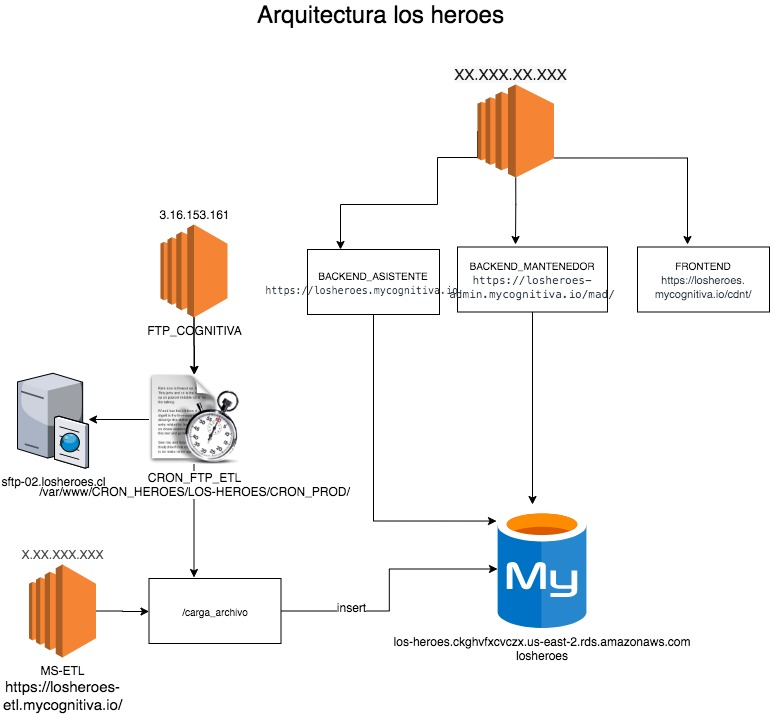

# LOS HEROES 
- Construido con Python 3.8

## JENKINS
- TAB: MAD
  - DEV_MAD_ASISTENTE
  - DEV_MAD_BACKEND
  - DEV_MAD_CDN
  - DEV_MAD_MANTENEDOR

## TO DO
- Refactorizar codigo, es necesario segmentar la carpeta "Functions" entre mods y views acorde, se ha estado agregando los mods correspondientes pero aun falta.
- Es necesario eliminar el archivo en la raiz "losheroes_settings.py", para esto se creo el archivo config.py en mods que se hace cargo de las variables de entorno y por otra parte las funciones que tiene de mongo se separaron en mongo_library.py de mods igualmente.
- Es necesario eliminar datadog de Functions ya que es una clase sin reusabilidad y utilizar la libreria de mods de datadog, se comenzo on el reemplazo pero aun faltan archivos donde cambiarlo, al igual que eliminar datadog del losheroes_settings.py y utilizar esta libreria.
- Mover middleware_utils.py en views correspondientemente, segmentando los toAnswer en la vista correspondiente
- Mover la logica de negocio que tiene el app.py en vistas segmentando como corresponda.
- REVISAR TABLA plantilla_correo para ser eliminada, ya que es una tabla antigua, NO CONFUNDIR CON "plantillas_correos" que es la nueva estructura y valida

## DIAGRAMA DE ARQUITECTURA

